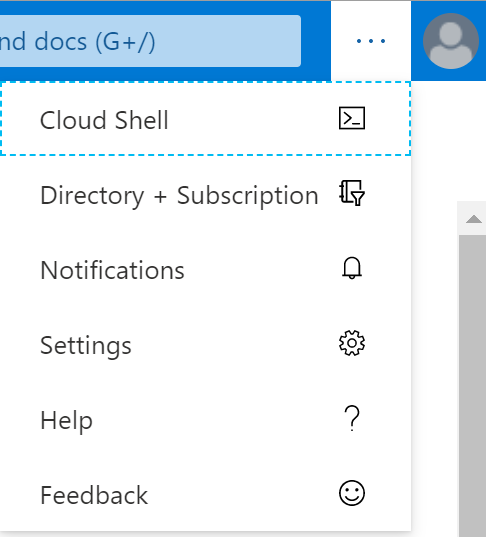
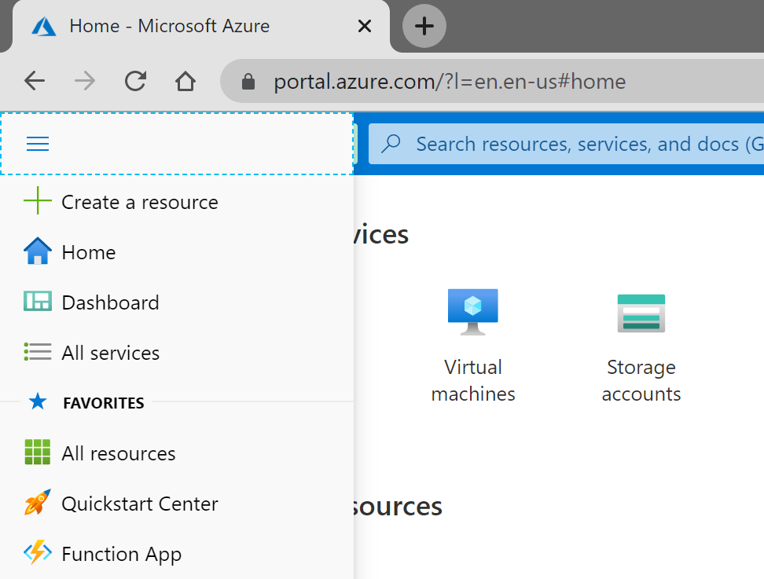
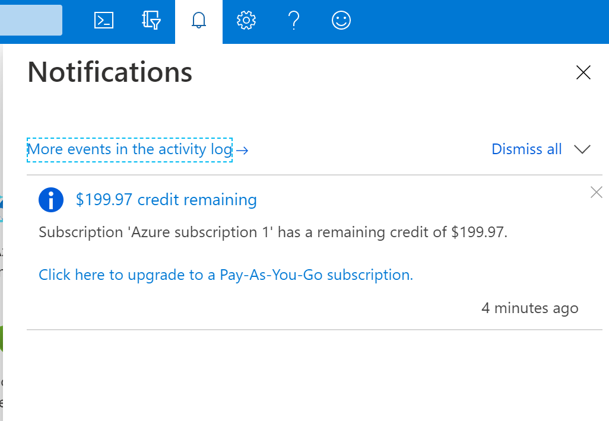
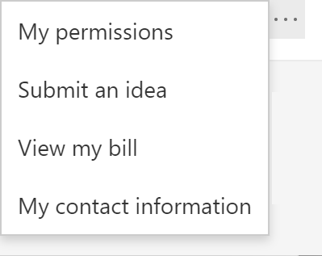
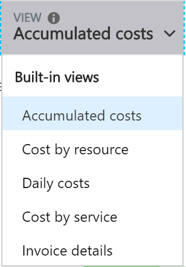

# Mini-lab: Use the Azure portal

The Azure portal has several features and services available; let's look at some of the more common areas you'll tend to use. First, take a moment to hover your mouse pointer over each of the icons in the top menu bar for a few seconds each. You should see a tooltip label pop-up for each one. This label is the name of the menu item. You will use these icons later.

If you don't see the top menu bar on a narrower screen, select the ellipses (...) button.

## All services
There are several services you will find in the azure portal.

1. Sign in to the [Azure portal](https://portal.azure.com) with your Azure account.

1. On the top left-hand side of the Azure portal, select **Show portal menu**.

     

1. Select **All services**. 
    * Take a couple of minutes to look through the list to see how many services Azure offers.

1. Select **Virtual machines**. (If you don't see it, use the search box in the top left corner of the view).

1. The **Virtual Machines** pane appears. Unless you previously created a virtual machine there will be no results.

1. Select **+ Add**. The **Create a virtual machine** pane appears.

1. Select the **X** in the top right corner to close the **Create a virtual machine** pane.

1. Select the **X** in the top right corner to close the **Virtual machines** pane.

1. Select **Microsoft Azure** in the top left-hand side to get back to the home page.

## Azure Cloud Shell

The Azure Cloud Shell allows you to use a command-line interface (CLI) to execute commands in your Azure subscription. You can access it by selecting the icon in the toolbar. You can also navigate to https://shell.azure.com to launch a Cloud Shell in the browser independent of the portal.

There are a variety of management and programming tools included in the created environment.

- Azure command-line tools (Azure CLI, AzCopy, etc.)
- Languages / Frameworks including .NET Core, Python, and Java
- Container management support for Docker, Kubernetes, etc.
- Code editors such as vim, emacs, code, and nano
- Build tools (make, maven, npm, etc.)
- Database query tools such as sqlcmd

Working with the CLI:
1. Click the Azure Cloud Shell icon

1. When you launch the shell, you see a Welcome window. 

1. You can choose either a **Bash** or **PowerShell** environment, depending on your personal preferences. Select any 
    * You can also change the shell at any time through the language drop-down on the left side of the shell.
1. Now you have accessed the Azure CLI
1. Write
    > az version
1. The CLI returns basic information about the Cloud Shell CLI Version in JSON format
1. You can close it now by clicking the **X** on the top right.

## Directory and subscription

1. Select the **Directory + Subscription** (book and filter) icon to show the **Directory + subscription** pane.

  This is where you can switch between multiple subscriptions or directories. If you have other Azure directories tied to the same email address, those subscriptions will be available as well.

  There is also a link to learn more about directories and subscriptions.

2. Select the **X** in the top right corner to close the **Directory + subscription** pane.

## Notifications pane

1. On the icon bar menu bar, select the **Notifications** (bell) icon. This window lists any pending notifications.

    

1. If any notifications appear, hover your mouse over one of them. Select the **X** that appears in that notification to dismiss it.

1. Select **Dismiss all**. You should have no notifications showing.

1. Select the **X** in the top right corner to close the **Notifications** pane.

## Settings

1. Select the **Settings** (cog) icon to open the **Portal settings** pane, showing the **General** settings by default.

1. Drop down the **Sign me out when inactive** setting. There you can select a convenient option, for example, selecting **After one hour** of inactivity for automatic sign out.

1. Under **Choose a theme**, select the different colored themes and observe the changes to the portal UI. Leave it set to the one you like the best.

1. Under **High contrast theme**, try the three different options.

1. Select **Enable pop-up notifications**. When this option is checked, notifications will appear as pop-up "toast"-style notifications. They will still show up in the Notifications (bell) icon as well.

1. Select the **Language & region** tab in the settings. Select **Language** and pick **Español**, and then select the **Apply** button. If a **Translate this page** dialog box appears, close the box. The whole portal is now in Spanish.

1. To revert back to English, select the **Settings** (cog) icon in the top menu bar and switch to the **Idioma y región** settings. Select **Idioma** and pick **English**. Select the **Aplicar** button. The portal returns to English.

## Help pane

1. Select the **Help** (?) icon to show the **Help** pane.

1. Select the **Help + support** button.

>:heavy_check_mark: **Note:** Support requests can only be created using an active paid subscription, therefore, some of these steps may be different from what you see

1. In the **Help + support** pane, under **Support**, select **New support request.** To create a new support request, you would fill in the information in each of the following sections:

    - **Basics**: the issue type

    - **Problem**: severity of the problem, a summary and description, and any additional information

    - **Contact information**: preferred contact method and the information associated with this contact method

1. Select **Create** to lodge the issue.

1. You can view the status of your support requests by selecting on **All support requests**.

### What's new and other information

1. Select the **Help** icon in the top right again, and select **What's new**.

1. Review the features that have recently been released. Also note and explore the other **Help** menu options, such as:
    - Azure roadmap
    - Launch guided tour
    - Keyboard shortcuts
    - Show diagnostics
    - Privacy statement

1. Select the **X** in the top right corner to close the **What's new** pane. You should now be back to the Dashboard.

## Feedback pane

If at any point on your Azure journey, you have some feedback or want to do a suggestion to us, you can do the following:

1. Select the **Feedback** (smiley face) icon to open the **Send us feedback** pane.

1. Type your impressions of Azure in the **Tell us about your experience** 

1. Select the box that says **Microsoft can email you about your feedback**

1. Select **Submit Feedback**.

1. A **Feedback sent** message will appear, and then close. You should now be back at the Dashboard.

## Profile settings

1. Select on your name in the top right corner of the portal. You will see:
    - Your Name
    - Your email
    - "My Mycrosoft account" link
    - "Switch Directory" link
    - Sign in with another account, or sign out entirely
    - An ellipse button. Click on it to see more options 
    
        

1. Select "..." then **View my bill** to navigate to the **Cost Management + Billing - Invoices** page, which helps you analyze where Azure is generating costs.

1. On the left menu, go to **Cost Management**

1. On the same left menu but now under Cost Management, select **Cost Analysis**

1. Right above the graphs displayed click in **View** 

    

1. From the drop-down menu select **Cost by Service**

>:heavy_check_mark: **Note:** You can now see the  cost details on each of your services. If your account is new or if you are using only free services. This page may be empty

1. Select the **X** in the top right corner to close the **Costs by service** pane.

1. Select the **X** in the top right corner to close the **Cost Management + Billing - Invoices** page and return to the home page.
