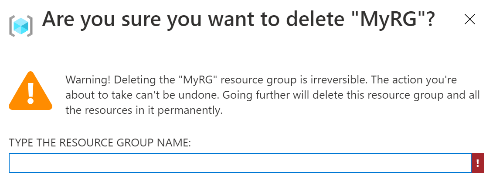

# Mini-lab: Create ARM templates by using Visual Studio Code

**Azure Resource Manager (ARM)** is a service for Azure that provides a management layer that enables you to create, update, and delete resources in your Azure account.

In this mini-lab, you will learn how to use Visual Studio Code and the Azure Resource Manager (ARM) Tools extension to create and edit Azure Resource Manager templates. You can create Resource Manager templates in Visual Studio Code without the extension, but the extension provides autocomplete options that simplify template development.

It's often easier and better to begin building your ARM template based on one of the existing Quickstart templates available on the [Azure Quickstart Templates](https://azure.microsoft.com/resources/templates/) site.

This mini-lab is based on the [Create a standard storage account](https://azure.microsoft.com/resources/templates/101-storage-account-create/) template.

## Prerequisites

You will need:

* Visual Studio Code. You can download a copy here: [https://code.visualstudio.com/](https://code.visualstudio.com/).
* Resource Manager Tools extension.

Follow these steps to install the Resource Manager Tools extension:

1. Open Visual Studio Code.
1. Press **CTRL+SHIFT+X** to open the Extensions pane.
1. Search for **Azure Resource Manager Tools**, and then select **Install**.
1. Select **Reload** to finish the extension installation.

## Open the Quickstart template

1. Go to the following address and copy the contents of the file

    ```
    https://raw.githubusercontent.com/Azure/azure-quickstart-templates/master/101-storage-account-create/azuredeploy.json
    ```


1. From Visual Studio Code, select **File > New File**.

1. Paste the previously copied code into the file

1. Select **File > Save As...** to save the file 

1. Save the file as *azuredeploy.json* to your local computer.


## Edit the template

Add one more element into the outputs section to show the storage URI.

1. Add the following code to the **outputs** property of the `azuredeploy.json`

    ```json
    "storageUri": {
        "type": "string",
        "value": "[reference(variables('storageAccountName')).primaryEndpoints.blob]"
    },
    ```

    When you are done, the outputs section looks like:

    ```json
    "outputs": {
        "storageAccountName": {
            "type": "string",
            "value": "[variables('storageAccountName')]"
        },
        "storageUri": {
            "type": "string",
            "value": "[reference(variables('storageAccountName')).primaryEndpoints.blob]"
        }
    }
    ```
    > **TIP:** Be careful that between `storageAccountName` and our just added `storageUri`, there is a colon (`,`)!

    If you copied and pasted the code inside Visual Studio Code, try to retype the **value** element to experience the IntelliSense capability of the Resource Manager Tools extension.

    

1. Select **File>Save** to save the file.


## Deploy the template

There are many methods for deploying templates, you will be using the Azure Cloud Shell. 

1. Sign in to the [Azure Cloud shell](https://shell.azure.com/).

     * If you are prompted with the message **"You have no storage mounted"** maintain the default selection and click **Create storage** (The creation of the storage may take a few seconds)

1. Wait for the terminal to succeed. When it's done you'll see:
    `*YourName*@Azure:~$`

1. Choose the **PowerShell** environment in the upper left corner. 

1. Restarting the shell is required when you switch. Click on the **Confirm** button

1. Wait for the terminal to succeed. When it's done you'll see:
    `PS /home/*YourName*>`

1. Select the **Upload/download files** icon, and then select **Upload**.

    

1. Select the file you saved in the previous section (**azuredeploy.json**). 

1. You'll see a confirmation box on the bottom right of the window
    * To confirm that your file has uploaded successfully, run the following command
    
        `ls`
    * If the console return **azuredeploy.json** (maybe among other files) the upload was successful

    
1. From the Cloud shell, run the following commands. 

    ```powershell
    $resourceGroupName = Read-Host -Prompt "Enter the Resource Group name"
    ```
    * This command will ask you to enter a name for your resource group (for example "MyRS")

    ```powershell
    $location = Read-Host -Prompt "Enter the location (i.e. centralus)"
    ```
    * This command will as you to enter the location for the resource group (for example westus, eastus or centralus)

    ```powershell
    New-AzResourceGroup -Name $resourceGroupName -Location "$location"
    ```
    * This command will show you the configuration you just entered

    ```powershell
    New-AzResourceGroupDeployment -ResourceGroupName $resourceGroupName -TemplateFile "$HOME/azuredeploy.json"
    ```
    * This command will create a new Azure `ResourceGroupDeployment` based on the values previously gave (this make take a few seconds)

        > Update the template file name if you save the file to a name other than **azuredeploy.json**.

    * The following screenshot shows a sample deployment:

        

    * The storage account name and the storage URL in the outputs section are highlighted on the screenshot. 

## Clean up resources

When the Azure resources are no longer needed, clean up the resources you deployed by deleting the resource group.
1. Go to your Azure account
1. On the search bar on top, write **Resource groups** and from the `services` select the one named "Resource groups"
1. Find the name of the resource goup you just created
1. Click on the name
1. From the options on top, click **Delete resource group**

    

1. You'll be asked to **TYPE THE RESOURCE GROUP NAME** to confirm the action (it's the name under `Home` on the top left of the window)

    

1. Now you'll be able to click the button **Delete** on the bottom of the window

1. Wait for the notifications panel to indicate that the resource has been deleted

1. We are done!

