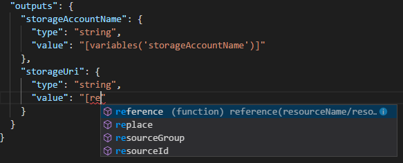

# Mini-lab: Create ARM templates by using Visual Studio Code

In this mini-lab you will learn how to use Visual Studio Code and the Azure Resource Manager Tools extension to create and edit Azure Resource Manager templates. You can create Resource Manager templates in Visual Studio Code without the extension, but the extension provides autocomplete options that simplify template development.

It's often easier and better to begin building your ARM template based off one of the existing Quickstart templates available on the [Azure Quickstart Templates](https://azure.microsoft.com/resources/templates/) site.

This mini-lab is based on the [Create a standard storage account](https://azure.microsoft.com/resources/templates/101-storage-account-create/) template.

## Prerequisites

You will need:

* Visual Studio Code. You can download a copy here: [https://code.visualstudio.com/](https://code.visualstudio.com/).
* Resource Manager Tools extension.

Follow these steps to install the Resource Manager Tools extension:

1. Open Visual Studio Code.
2. Press **CTRL+SHIFT+X** to open the Extensions pane.
3. Search for **Azure Resource Manager Tools**, and then select **Install**.
4. Select **Reload** to finish the extension installation.

## Open the Quickstart template

1. From Visual Studio Code, select **File > Open File**.

2. In **File name**, paste the following URL:

    ```
    https://raw.githubusercontent.com/Azure/azure-quickstart-templates/master/101-storage-account-create/azuredeploy.json
    ```

3. Select **Open** to open the file.

4. Select **File > Save As** to save the file as *azuredeploy.json* to your local computer.

## Edit the template

Add one more element into the outputs section to show the storage URI.

1. Add one more output to the exported template:

    ```json
    "storageUri": {
        "type": "string",
        "value": "[reference(variables('storageAccountName')).primaryEndpoints.blob]"
    },
    ```

    When you are done, the outputs section looks like:

    ```json
    "outputs": {
        "storageAccountName": {
            "type": "string",
            "value": "[variables('storageAccountName')]"
        },
        "storageUri": {
            "type": "string",
            "value": "[reference(variables('storageAccountName')).primaryEndpoints.blob]"
        }
    }
    ```

    If you copied and pasted the code inside Visual Studio Code, try to retype the **value** element to experience the IntelliSense capability of the Resource Manager Tools extension.

    

2. Select **File>Save** to save the file.


## Deploy the template

There are many methods for deploying templates, you will be using the Azure Cloud shell. 

1. Sign in to the [Azure Cloud shell](https://shell.azure.com/).

2. Choose the **PowerShell** environment in the upper left corner. Restarting the shell is required when you switch. 

3. Select **Upload/download** files, and then select **Upload**.

    

    Select the file you saved in the previous section. The default name is **azuredeploy.json**. The template file must be accessible from the shell. You can use the **ls** command and the **cat** command to verify the file was uploaded successfully.
    
4. From the Cloud shell, run the following commands. 

    ```powershell
    $resourceGroupName = Read-Host -Prompt "Enter the Resource Group name"
    $location = Read-Host -Prompt "Enter the location (i.e. centralus)"

    New-AzResourceGroup -Name $resourceGroupName -Location "$location"
    New-AzResourceGroupDeployment -ResourceGroupName $resourceGroupName -TemplateFile "$HOME/azuredeploy.json"
    ```

    Update the template file name if you save the file to a name other than **azuredeploy.json**.

    The following screenshot shows a sample deployment:

    

    The storage account name and the storage URL in the outputs section are highlighted on the screenshot. 

## Clean up resources

When the Azure resources are no longer needed, clean up the resources you deployed by deleting the resource group.

