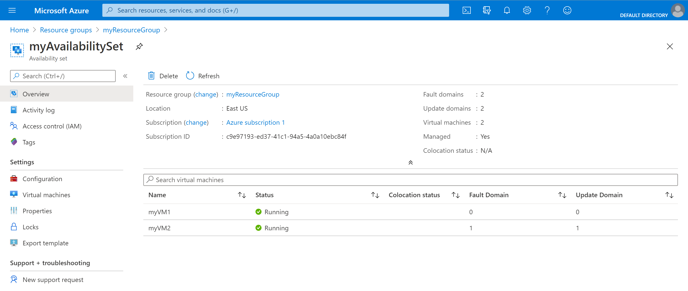

# Mini-lab: Create VMs inside an availability set

## Prerequisites

Prior to this mini-lab we need to set the environment variable `AdminPassword` before hand. To do that:

1. Launch Cloud Shell from the top navigation of the Azure portal.

    

    * If you don't see the top menu bar on a narrower screen, select the ellipses (...) button.

        

    * If you are prompted with the message **"You have no storage mounted"** maintain the default selection and click **Create storage** (The creation of the storage may take a few seconds)

1. Once the Cloud Shell opens, check that the environment drop-down from the left-hand side of shell window says **Bash**.

    

    * If it does not says "Bash", click and select `Bash`. Confirm

1. Once the bash is ready, enter the following command

    `
    AdminPassword="myStr0ngPW%%"
    `

    > you may change *myStr0ngPW%%* for any value of your preference, but the password length must be between 12 and 72 characters, and have 1 lower case character, 1 upper case character, 1 number and 1 special character
1. Confirm that you have set your environment variable with the following command:

    `
    echo $AdminPassword
    `


## Create an availability set

1. To create a resource group, we are going to run the following command: 

    `az group create --name myResourceGroup --location eastus`

1. Create a managed availability set by running the following command: 

    `az vm availability-set create --resource-group myResourceGroup --name myAvailabilitySet --platform-fault-domain-count 2 --platform-update-domain-count 2`
    * This may take a few seconds

## Create VMs inside an availability set

VMs must be created within the availability set to make sure that they are correctly distributed across the hardware. You can't add an existing VM to an availability set after it's created.

> When you create a VM with az vm create, you use the --availability-set parameter to specify the name of the availability set.

1. Create two virtual machines by running the following command:

    ```
    for i in `seq 1 2`; do
    az vm create \
        --resource-group myResourceGroup \
        --name myVM$i \
        --availability-set myAvailabilitySet \
        --vnet-name MyVnet --subnet subnet1 \
        --image debian \
        --admin-password $AdminPassword \
        --admin-username azureuser \
        --no-wait
    done
    ```

1. It takes a few minutes to create and configure both VMs. When it finishes, you will have two virtual machines distributed across the underlying hardware.

1. On the searchbar at the top of the window, write **Resource Groups** and select the service of that name

1. Once on the resource groups view, select **myResourceGroup**

1. On the window that appears to the right, you will see all the resources contained by `myResourceGroup`. Select **myAvailabilitySet**

1. ou should see how the VMs are distributed across the two fault and update domains.

    

## Clean up deployment

1. Run the following command to remove the resource group, VM, and all related resources: `az group delete --name myResourceGroup --yes`

    * This may take a while, wait for the console to finish
