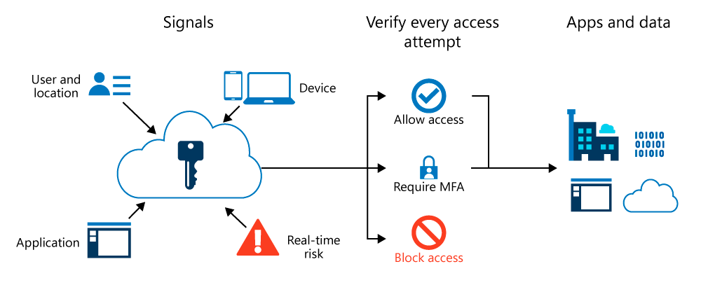
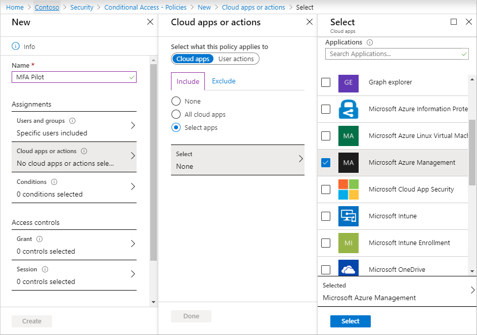
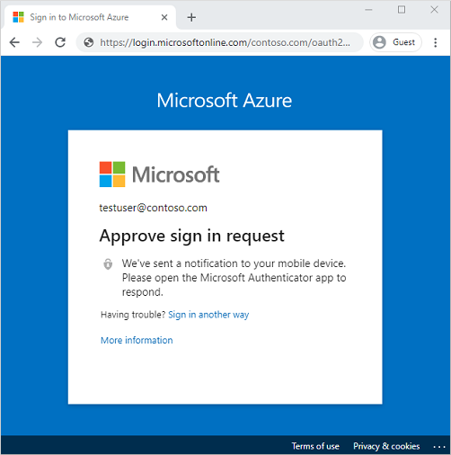

# Mini-lab: Secure user sign-in events with Azure Multi-Factor Authentication

Multi-factor authentication (MFA) is a process where a user is prompted during a sign-in event for additional forms of identification. The user might be prompted to enter a code on their cellphone or to provide a fingerprint scan. Requiring a second form of authentication increases security because the additional factor is not easy for an attacker to obtain or duplicate.

Azure Multi-Factor Authentication and Conditional Access policies give the flexibility to enable MFA for users during specific sign-in events.

**Prerequisites**

To perform this demonstration you need the following resources and privileges:

* A working Azure AD tenant with Azure AD Premium or trial license enabled. 

* An account with global administrator privileges.

* A non-administrator user with a password you know, such as testuser. You will test the end-user Azure Multi-Factor Authentication experience using this account in this mini-lab. 

* A group that the non-administrator user is a member of, such as MFA-Test-Group. You enable Azure Multi-Factor Authentication for this group in this mini-lab. 

## Create a Conditional Access Policy

The recommended way to enable and use Azure Multi-Factor Authentication is with Conditional Access policies. Conditional Access lets you create and define policies that react to sign-in events and request additional actions before a user is granted access to an application or service.

In this demonstration you will create a basic Conditional Access policy to prompt for MFA when a user signs in to the Azure portal. 

First, create a Conditional Access policy and assign your test group of users as follows:

1. Sign in to the [Azure portal](https://portal.azure.com/) using an account with global administrator permissions.

2. Search for and select **Azure Active Directory**, then choose **Security**.

3. Select **Conditional Access**, then choose **+ New policy**.

4. Enter a name for the policy, such as *MFA Pilot*.

5. Under **Assignments**, choose **Users and groups**, then **Select users and groups**.

6. Check the box for **Users and groups**, then **Select**.

7. Browse for and select your Azure AD group, such as *MFA-Test-Group*, then choose **Select**.

    

8. To apply the Conditional Access policy for the group, select **Done**.

## Configure the conditions for Multi-Factor Authentication

With the Conditional Access policy created and a test group of users assigned, you can now define the cloud apps or actions that trigger the policy. These cloud apps or actions are the scenarios you decide require additional processing, such as to prompt for MFA. 

Configure the Conditional Access policy to require MFA when a user signs in to the Azure portal.

1. Select **Cloud apps or actions**. You can choose to apply the Conditional Access policy to *All cloud apps* or *Select apps*.

1. On the **Include** page, choose **Select apps**.

2. Choose **Select**, then browse the list of available sign-in events that can be used.

1. Choose **Microsoft Azure Management** so the policy applies to sign-in events to the Azure portal.

3. To apply the select apps, choose **Select**, then **Done**.

    

1. Access controls let you define the requirements for a user to be granted access, such as needing an approved client app or using a device that's Hybrid Azure AD joined. Configure the access controls to require MFA during a sign-in event to the Azure portal.

1. Under **Access controls**, choose **Grant**, then make sure that **Grant access** is selected.

2. Check the box for **Require multi-factor authentication**, then choose **Select**.

    Conditional Access policies can be set to Report-only if you want to see how the configuration would impact users, or Off if you don't want to use the policy right now. Because a test group of users was targeted for this demonstration, let's enable the policy and then test Azure Multi-Factor Authentication.

1. Set the *Enable policy* to **On**.

2. To apply the *Conditional Access policy*, select **Create**.

## Test Azure Multi-Factor Authentication

To view the Conditional Access policy and Azure Multi-Factor Authentication, sign in to a resource that doesn't require MFA as follows:

1. Open a new browser window in InPrivate or incognito mode and browse to [https://account.activedirectory.windowsazure.com](https://account.activedirectory.windowsazure.com/).

2. Sign in with your non-administrator test user, such as testuser. There's no prompt for you to complete MFA.

3. Close the browser window.

    Now sign in to the Azure portal. Because the Azure portal was configured in the Conditional Access policy to require additional verification, you will get an Azure Multi-Factor Authentication prompt.

1. Open a new browser window in InPrivate or incognito mode and browse to [https://portal.azure.com](https://portal.azure.com/).

2. Sign in with your non-administrator test user, such as testuser. You're required to register for and use Azure Multi-Factor Authentication. Follow the prompts to complete the process and verify that you have successfully signed in to the Azure portal.

    

 
