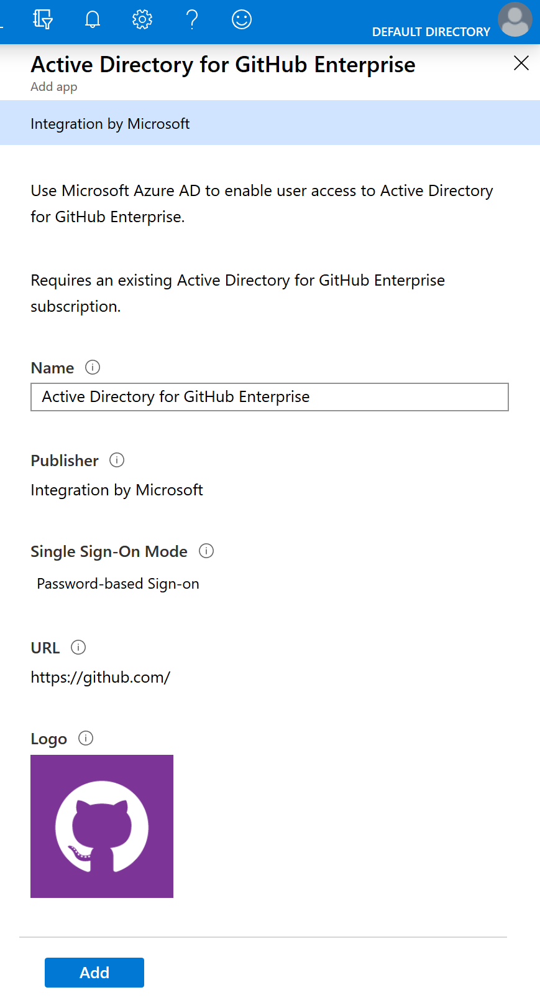
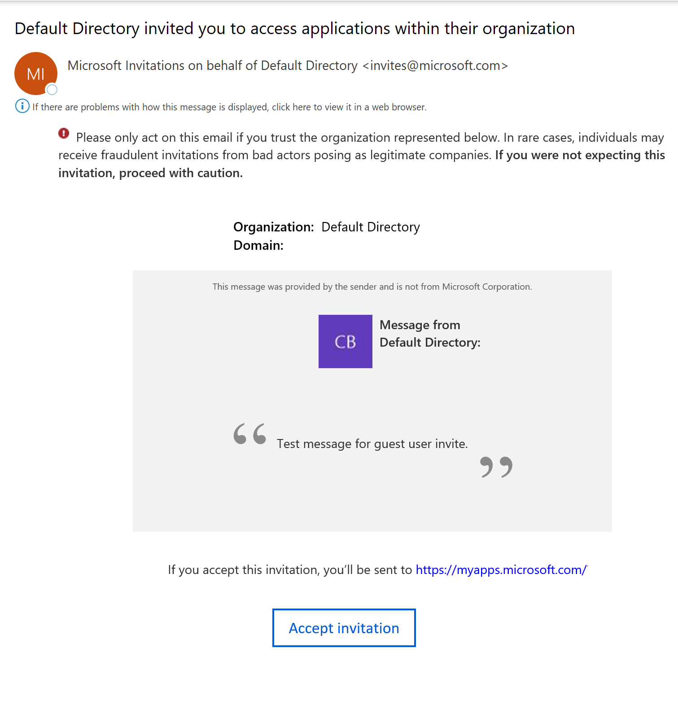

# Mini-lab: Add Guest users to Azure AD in the Azure Portal

You can invite anyone to collaborate with your organization by adding them to your directory as a guest user. Then you can either send an invitation email that contains a redemption link or send a direct link to an app you want to share. 

Guest users can sign in with their own work, school, or social identities.

In this mini-lab, you'll add a new guest user to Azure AD and send an invitation.

## Prerequisites

To complete the scenario in this mini-lab you need:

* A role that allows you to create users in your tenant directory, like the Global Administrator role or any of the limited administrator directory roles.

* A valid email account that you can add to your tenant directory, and that you can use to receive the test invitation email.

## Add Guest users to Azure AD

1. Sign in to the [Azure portal](https://portal.azure.com/) as an Azure AD administrator.

1. In the left pane, select **Azure Active Directory**.

1. On the **Manage** left panel on the left, select **Users**.

    

1. Select **New guest user** on the top bar

    

1. On the **New user** page, select **Invite user** and  add the guest user's information.

    

    - ***Identity***
        - **Name:** The first and last name of the guest user.

        - **Email address (required):** The email address of the guest user.

    - ***Personal message (optional):*** Include a personal welcome message to the guest user.

    - ***Groups and roles*** 
    
        - **Groups:** You can add the guest user to one or more existing groups, or you can do it later.

        - **Directory role:** If you require Azure AD administrative permissions for the user, you can add them to an Azure AD role.
    - ***Settings***
        - **Block sign in (optionl):** Allows you to block an user to sign-in without deleting the profile 
        - **Usage location (optional):** The physicall location of the user
    - ***Job info***
        - **Job totle (optionla)**
        - **Department (optional)**

1. Select **Invite** to automatically send the invitation to the guest user. A notification appears in the upper right with the message Successfully invited user.

1. After you send the invitation, the user account is automatically added to the directory as a guest.

## Assign an App to a Guest user

Add the *Active Directory for GitHub Enterprise* app to your test tenant and assign the test guest user to the app.

1. Sign in to the Azure portal as an Azure AD administrator.

1. In the left pane, select **Enterprise applications**.
    - If you don't see the option on the left pane, you can search for it on the search box on top of the page

1. Select **New application**.

    

1. Under **Add from the gallery**, search for **GitHub**, and then select **Active Directory for GitHub Enterprise**.

    

1. Select **Add** (or Create). It will show you a new window

    

1. Under the Manage left pane, select Single **sign-on**, and under **Single Sign-on Mode**, select **Password-based Sign-on**, and click **Save**.

1. Under the **Manage** left pane, select **Users and groups > Add user**

1.  Click **Users**, a rigth pane will appear, click the user you want to add, and then Users click **Select**.

    

1. Select **Assign**.

## Accept the Guest user invite

Now sign in to the guest user email account to view the invitation.

1. Sign in to your test guest user's email account.

1. In the inbox, find the "*You're invited*" email.

1. In the email body, select Get Started. A Review permissions page opens in the browser.

1. Select **Accept Invitation**. The Access Panel opens, which lists the applications the guest user can access.

    
