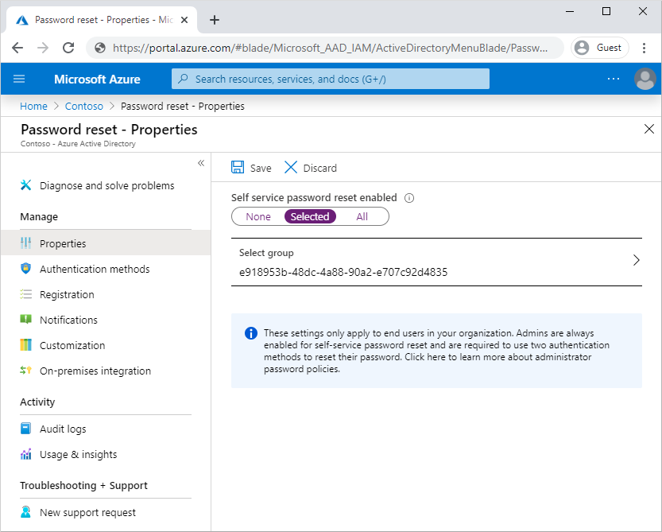
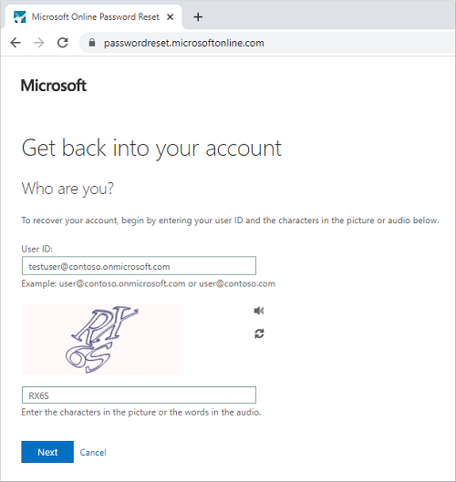

# Mini-lab: Enable Azure AD Self-Service Password Reset

Azure Active Directory (Azure AD) self-service password reset (SSPR) gives users the ability to change or reset their password, with no administrator or help desk involvement. If a user's account is locked or they forget their password, they can follow prompts to unblock themselves and get back to work. This ability reduces help desk calls and loss of productivity when a user can't sign in to their device or an application.

This topic demonstrates how to enable self-service password reset. 

* Enable self-service password reset for a group of Azure AD users

* Configure authentication methods and registration options

* Test the SSPR process as a user

## Prerequisites

To complete this demonstration, you need the following resources and privileges:

* A working Azure AD tenant with at least a trial license enabled. 

* An account with Global Administrator privileges.

* A non-administrator user with a password you know, such as testuser. You test the end-user SSPR experience using this account in this demonstration. 

* A group that the non-administrator user is a member of, such as SSPR-Test-Group. You enable SSPR for this group in this demonstration. 

## Enable self-service password reset

Azure AD lets you enable SSPR for None, Selected, or All users. This granular ability lets you choose a subset of users to test the SSPR registration process and workflow. When you're comfortable with the process and can communicate the requirements with a broader set of users, you can select additional groups of users to enable for SSPR. Or, you can enable SSPR for everyone in the Azure AD tenant.

In this demonstration, configure SSPR for a set of users in a test group. In the following example, the group SSPR-Test-Group is used. Provide your own Azure AD group as needed:

1. Sign in to the [Azure portal](https://portal.azure.com/) using an account with global administrator permissions.

2. Search for and select **Azure Active Directory**, then choose **Password reset** from the menu on the left-hand side.

3. From the **Properties** page, under the option Self service password reset enabled, choose **Select group**.

4. Browse for and select your Azure AD group, such as *SSPR-Test-Group*, then choose **Select**.

    

    As part of a wider deployment of SSPR, nested groups are supported. Make sure that the users in the group(s) you choose have the appropriate licenses assigned. There's currently no validation process of these licensing requirements.

5. To enable SSPR for the select users, select **Save**.

## Select authentication methods and registration options

When users need to unlock their account or reset their password, they're prompted for an additional confirmation method. This additional authentication factor makes sure that only approved SSPR events are completed. You can choose which authentication methods to allow, based on the registration information the user provides.

1. On the **Authentication methods** page from the menu in the left-hand side, set the **Number of methods required to reset** to *1*.

    To improve security, you can increase the number of authentication methods required for SSPR.

2. Choose the **Methods available to users** that your organization wants to allow. For this demonstration, check the boxes to enable the following methods:

    - *Mobile app notification*

    - *Mobile app code*

    - *Email*

    - *Mobile phone*

    - *Office phone*

3. To apply the authentication methods, select **Save**.

    Before users can unlock their account or reset a password, they must register their contact information. This contact information is used for the different authentication methods configured in the previous steps.

    An administrator can manually provide this contact information, or users can go to a registration portal to provide the information themselves. In this demonstration, configure the users to be prompted for registration when they next sign in.

1. On the **Registration** page from the menu in the left-hand side, select Yes for **Require users to register when signing in**.

2. It's important that contact information is kept up to date. If the contact information is outdated when an SSPR event is started, the user may not be able to unlock their account or reset their password.

1. Set **Number of days before users are asked to reconfirm their authentication information** to *180*.

3. To apply the registration settings, select **Save**.

## Configure notifications and customizations

To keep users informed about account activity, you can configure e-mail notifications to be sent when an SSPR event happens. These notifications can cover both regular user accounts and admin accounts. For admin accounts, this notification provides an additional layer of awareness when a privileged administrator account password is reset using SSPR.

1. On the **Notifications** page from the menu in the left-hand side, configure the following options:

    - Set **Notify users on password resets option** to *Yes*.

    - Set **Notify all admins when other admins reset their password** to *Yes*.

2. To apply the notification preferences, select **Save**.

## Test Self-Service Password Reset

With SSPR enabled and configured, test the SSPR process with a user that's part of the group you selected in the previous section, such as Test-SSPR-Group. In the following example, the testuser account is used. Provide your own user account that's part of the group you enabled for SSPR in the first section of this demonstration.

>**Note**
When you test the self-service password reset, use a non-administrator account. Admins are always enabled for self-service password reset and are required to use two authentication methods to reset their password.

1. To see the manual registration process, open a new browser window in InPrivate or incognito mode, and browse to [https://aka.ms/ssprsetup](https://aka.ms/ssprsetup). Users should be directed to this registration portal when they next sign-in.

2. Sign in with a non-administrator test user, such as testuser, and register your authentication methods contact information.

3. Once complete, select the button marked **Looks good** and close the browser window.

4. Open a new browser window in InPrivate or incognito mode, and browse to [https://aka.ms/sspr](https://aka.ms/sspr).

5. Enter your non-administrator test users' account information, such as testuser, the characters from the CAPTCHA, and then select **Next**.

    

6. Follow the verification steps to reset your password. When complete, you should receive an e-mail notification that your password was reset.