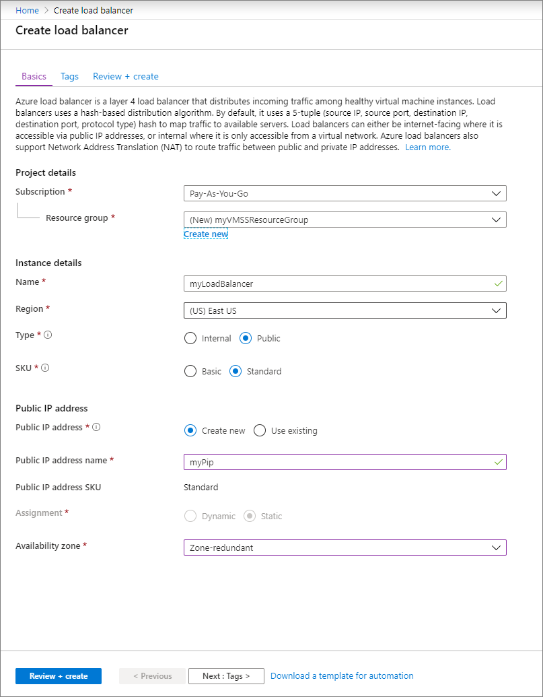
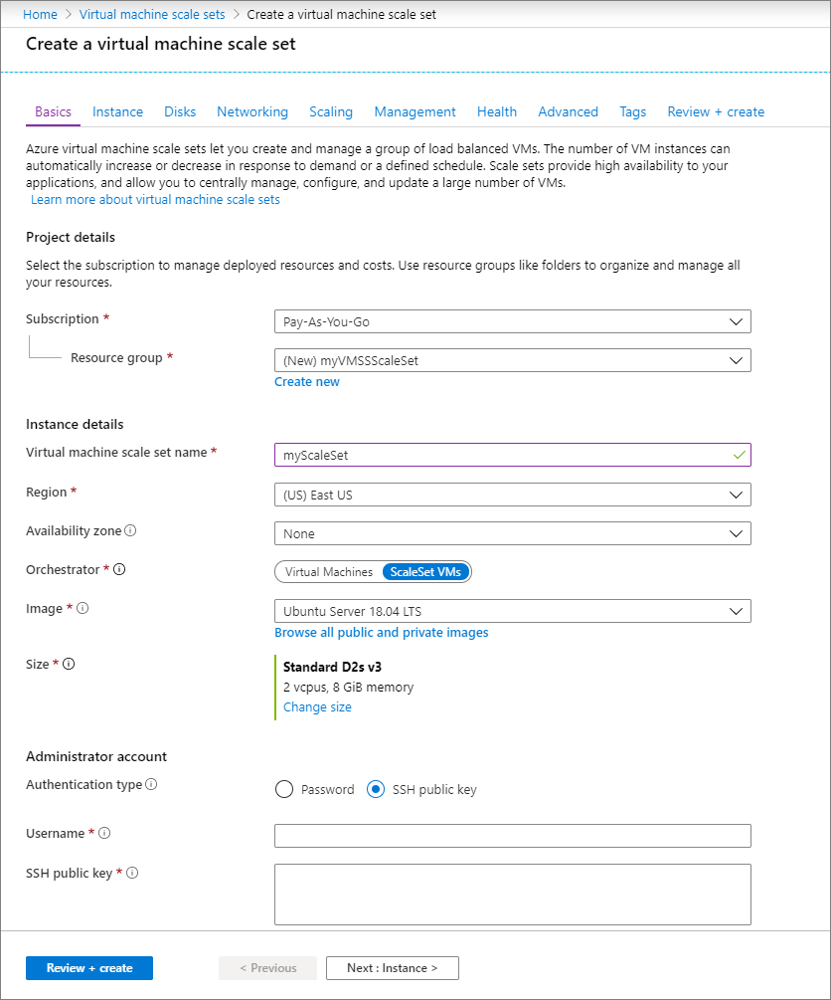

# Mini-lab: Create a VM Scale Set in the Azure Portal

## Create public load balancer

Create a public load balancer using the portal. The name and public IP address you create are automatically configured as the load balancer's front end.

1. In the search box, type *load balancer*. Under **Marketplace** in the search results, pick **Load balancer**.

2. In the **Basics** tab of the Create load balancer page, enter or select the following information:

| Setting 	| Value 	|
|------------------------	|-----------------------------------------------------------------	|
| Subscription 	| Select your subscription. 	|
| Resource group 	| Select Create new and type myVMSSResourceGroup in the text box. 	|
| Name 	| myLoadBalancer 	|
| Region 	| Select East US. 	|
| Type 	| Select Public. 	|
| SKU 	| Select Standard. 	|
| Public IP address 	| Select Create new. 	|
| Public IP address name 	| MyPip 	|
| Assignment 	| Static 	|
| Availability zone 	| Zone-redundant 	|

3. Select **Review + create**.

4. Select **Create**.

## Create virtual machine scale set

You can deploy a scale set with a Windows Server image or Linux image such as RHEL, CentOS, Ubuntu, or SLES.

1. Type *Scale set* in the search box. In the results, under **Marketplace**, select **Virtual machine scale sets**. The **Create a virtual machine scale set** page will open.

2. In the **Basics** tab, under **Project details**, make sure the correct subscription is selected and then choose **Create new** resource group. Type *myVMSSResourceGroup* for the name and then select OK .

3. Type *myScaleSet* as the name for your scale set.

4. In **Region**, select a region that is close to your area.

5. Leave the default value of **ScaleSet VMs** for **Orchestrator**.

6. Select a marketplace image for Image. In this example, we have chosen Ubuntu Server 18.04 LTS.

7. Enter your desired username, and select which authentication type you prefer.

    - A **Password** must be at least 12 characters long and meet three out of the four following complexity requirements: one lower case character, one upper case character, one number, and one special character. 

    - If you select a Linux OS disk image, you can instead choose **SSH public key**. Only provide your public key, such as ~/.ssh/id_rsa.pub. You can use the Azure Cloud Shell from the portal to create and use SSH keys.

    

8. Select **Next** to move the the other pages. As you explore each tab, review the attributes of the VMs in the Scale Set being created​.

9. Review the**Instance** and **Disks** tabs, but leave the default values in place.

10. On the **Networking** page, under **Load balancing**, select **Yes** to put the scale set instances behind a load balancer.

11. In **Load balancing options**, select **Azure load balancer**.

12. In **Select a load balancer**, select **myLoadBalancer** that you created earlier.

13. For **Select a backend pool**, select **Create** new, type *myBackendPool*, and select **Create**.

1. Inspect the **Scaling** tab and the **Management** tab default values

14. Select **Review + create**.

15. Select **Create** to deploy the scale set.

 ## Clean up resources

 When no longer needed, delete the resource group, scale set, and all related resources. To do so, select the resource group for the scale set and then select **Delete**.