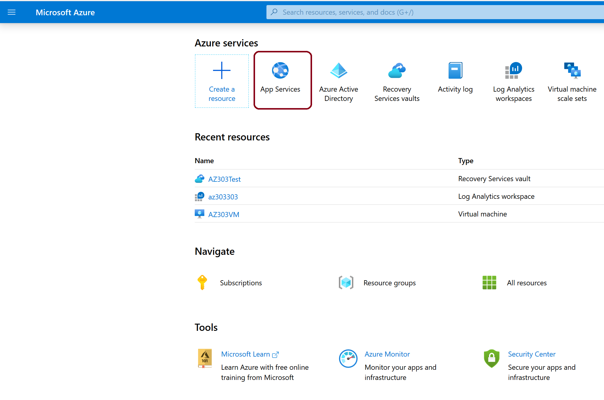
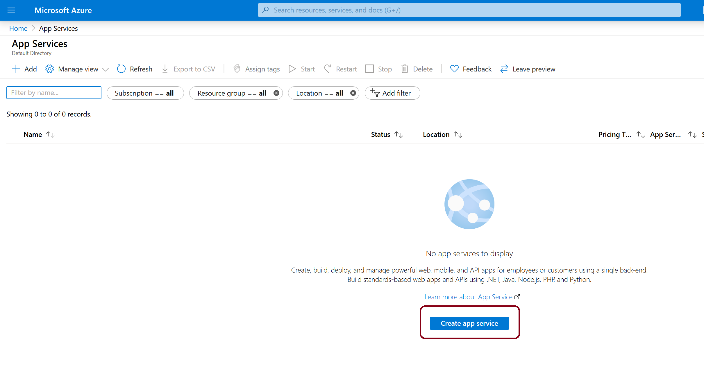
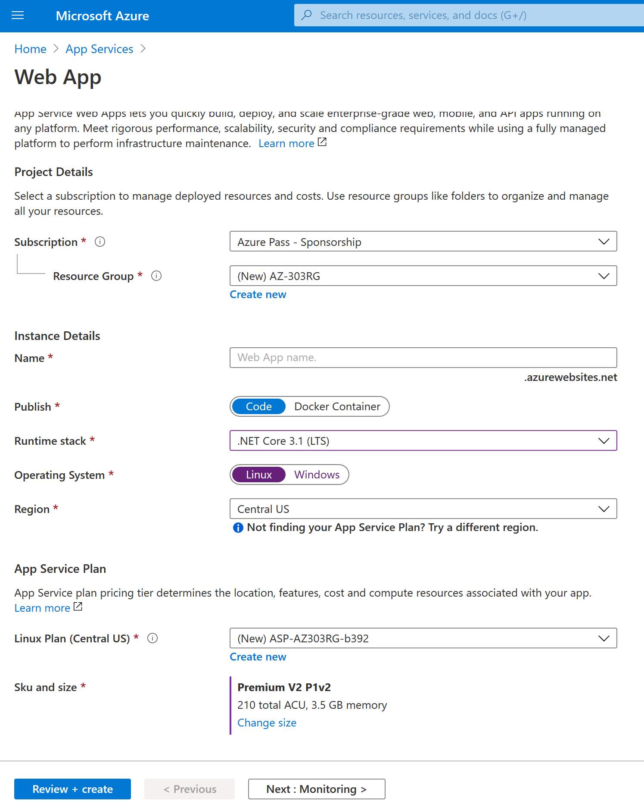
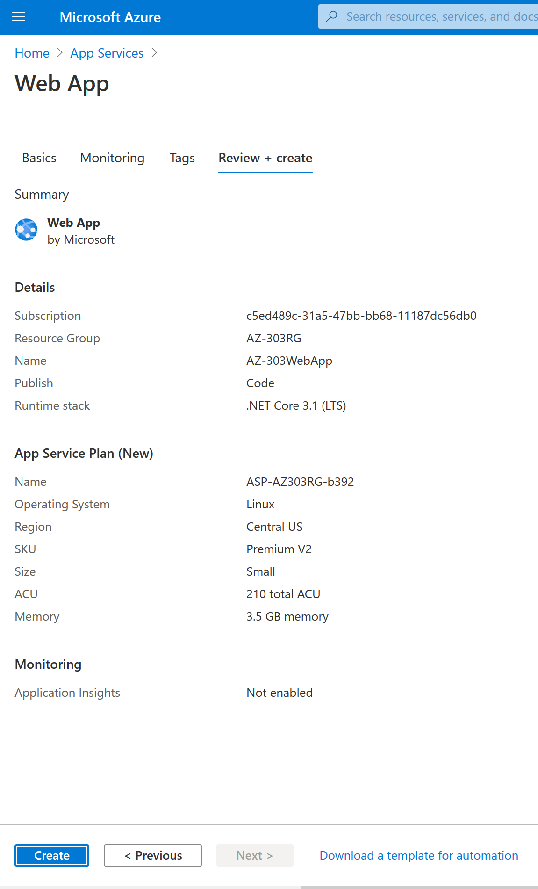
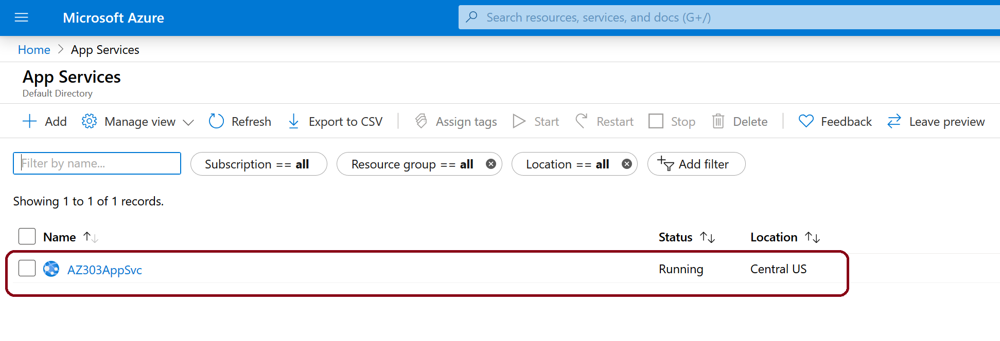
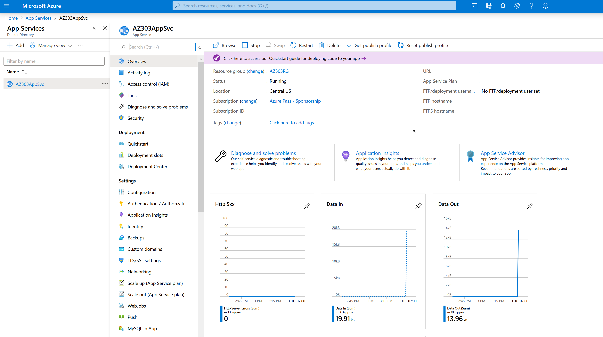

# Mini-lab: Create an App Service and Web App

In this demonstration, you will use the Azure portal to create a web app and an Azure App Service.

## Create App Service and web app

1. Sign in to the Azure portal at [https://portal.azure.com](https://portal.azure.com/).

1. On the Azure portal menu or from the **Home** page, select **App Services**. 

    

2. From the **App Services page**, select **Create app service**. 

    

3. From the **Web App**, complete the following values:

| Field | Value | Details |
|------------------|-----------------------------------------------|-------------------------------------------------------------------------------------------------------------------------------------------------------------------------------------------------------------------------------------------------------------------------------------------------------------------------|
| Subscription | Select your subscription | The web app you are creating must belong to a resource group. Here, you select the Azure subscription to which the resource group belongs (or will belong, if you are creating it within the wizard). |
| Resource Group | Select from the menu | The resource group to which the web app will belong. All Azure resources must belong to a resource group. |
| Name | Enter a unique name | The name of your web app. This name will be part of the app's URL: appname.azurewebsites.net. The name you choose must be unique among all Azure web apps. |
| Publish | Code | The method you will use to publish your application. When publishing your application as code, you also must configure Runtime stack to prepare your App Service resources to run your app. |
| Runtime stack | .NET Core 3.1 (LTS) | The platform on which your application runs. Your choice may affect whether you have a choice of operating system - for some runtime stacks, App Service supports only one operating system. |
| Operating System | Linux | The operating system used on the virtual servers that run your app. |
| Region | Central US | The geographical region from which your app will be hosted. |
| Linux Plan | Leave default | The name of the App Service plan that will power your app. By default, the wizard will create a new plan in the same region as the web app. |
| Sku and size | Default | The pricing tier of the plan being created. This determines the performance characteristics of the virtual servers that power your app, and the features it has access to. To select the F1 tier, select Change size to open the Spec Picker wizard. On the Dev / Test tab, select F1 from the list, then select Apply. |

4. Select **Review and Create** to navigate to the review page, then select **Create** to create the web app.

    

> **Note**: It can take a few seconds to get your web app created and ready for your use.

The portal will display the deployment page, where you can view the status of your deployment. 

## Preview web app

Once the app is ready, navigate to the new app in the Azure portal:

1. On the Azure portal menu or from the **Home page**, select **All resources**.

2. Select the App Service for your web app from the list. Make sure to select the App Service, and not the App Service plan.

    

    The portal displays the **App Services** overview page.

    

1. To preview your new web app's default content, select its URL at the top right. The placeholder page that loads indicates that your web app is up and running and ready to receive deployment of your app's code.

    

 
