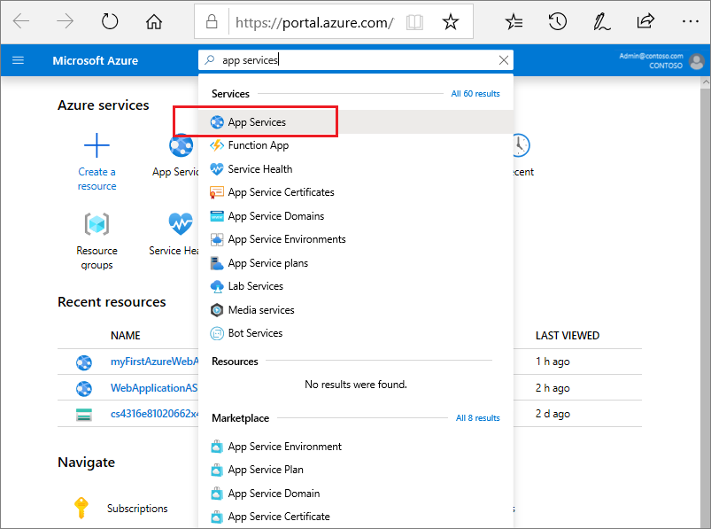

# Mini-lab: Deploy staging slots

Deploying your application to a non-production slot has the following benefits:

* You can validate app changes in a staging deployment slot before swapping it with the production slot.
* Deploying an app to a slot first and swapping it into production makes sure that all instances of the slot are warmed up before being swapped into production. This eliminates downtime when you deploy your app. The traffic redirection is seamless, and no requests are dropped because of swap operations. You can automate this entire workflow by configuring [auto swap](#Auto-Swap) when pre-swap validation isn't needed.
* After a swap, the slot with previously staged app now has the previous production app. If the changes swapped into the production slot aren't as you expect, you can perform the same swap immediately to get your "last known good site" back.

## Add a slot
The app must be running in the **Standard**, **Premium**, or **Isolated** tier in order for you to enable multiple deployment slots.

1. in the [Azure portal](https://portal.azure.com/), search for and select **App Services** and select your app. 
   
    
   
2. In the left pane, select **Deployment slots** > **Add Slot**.
   
    
   
   > **NOTE:** If the app isn't already in the **Standard**, **Premium**, or **Isolated** tier, you receive a message that indicates the supported tiers for enabling staged publishing. At this point, you have the option to select **Upgrade** and go to the **Scale** tab of your app before continuing.

3. In the **Add a slot** dialog box, give the slot a name, and select whether to clone an app configuration from another deployment slot. Select **Add** to continue.
   
    
   
    You can clone a configuration from any existing slot. Settings that can be cloned include app settings, connection strings, language framework versions, web sockets, HTTP version, and platform bitness.

4. After the slot is added, select **Close** to close the dialog box. The new slot is now shown on the **Deployment slots** page. By default, **Traffic %** is set to 0 for the new slot, with all customer traffic routed to the production slot.

5. Select the new deployment slot to open that slot's resource page.
   
    

    The staging slot has a management page just like any other App Service app. You can change the slot's configuration. To remind you that you're viewing the deployment slot, the app name is shown as **\<app-name>/\<slot-name>**, and the app type is **App Service (Slot)**. You can also see the slot as a separate app in your resource group, with the same designations.

The new deployment slot has no content, even if you clone the settings from a different slot. For example, you can publish to this slot with Git. You can deploy to the slot from a different repository branch or a different repository.

## Swap two slots 
You can swap deployment slots on your app's **Deployment slots** page and the **Overview** page.

> **Important:** Before you swap an app from a deployment slot into production, make sure that production is your target slot and that all settings in the source slot are configured exactly as you want to have them in production.

To swap deployment slots:

1. Go to your app's **Deployment slots** page and select **Swap**.
   
    

    The **Swap** dialog box shows settings in the selected source and target slots that will be changed.

2. Select the desired **Source** and **Target** slots. Usually, the target is the production slot. Also, select the **Source Changes** and **Target Changes** tabs and verify that the configuration changes are expected. When you're finished, you can swap the slots immediately by selecting **Swap**.

    

3. When you're finished, close the dialog box by selecting **Close**.
