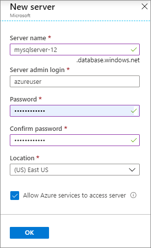
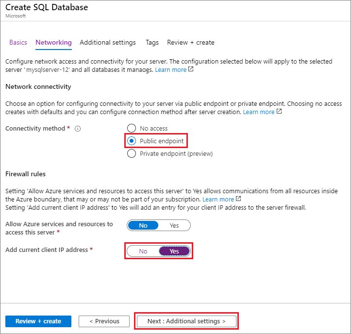
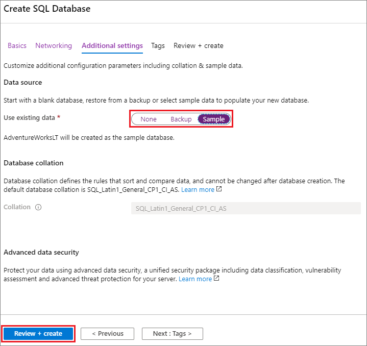

# Mini-lab: Create an Azure SQL Database single database

In this mini-lab, you will use the Azure portal to create an Azure SQL Database single database. You will then query the database using Query editor in the Azure portal.

A single database is the quickest and simplest deployment option for Azure SQL Database. You can manage a single database within a SQL Database server, which is inside an Azure resource group in a specified Azure region. In this mini-lab, you will create a new resource group and SQL server for the new database.

You can create a single database in the *provisioned* or *serverless* compute tier. A provisioned database is pre-allocated a fixed amount of compute resources, including CPU and memory, and uses one of two purchasing models. This mini-lab creates a provisioned database using the vCore-based purchasing model.

## Create a single database

In this step, you will create an Azure SQL Database server and a single database that uses AdventureWorksLT sample data. You can create the database by using Azure portal menus and screens, or by using an Azure CLI or PowerShell script in the Azure Cloud Shell.

To create a resource group, SQL server, and single database in the Azure portal:

1. Sign in to the Azure portal at [https://portal.azure.com](https://portal.azure.com/).

2. From the Search bar, search for and select **Azure SQL**.

3. On the Azure SQL page, select **Add**.


4. On the **Select SQL deployment option** page, select the **SQL databases** tile, with **Single database** under **Resource** type. You can view more information about the different databases by selecting **Show details**.

5. Select **Create**.


6. On the **Basics** tab of the Create SQL database form, under **Project details**, select the correct Azure Subscription if it isn't already selected.

7. Under **Resource group**, select **Create new**, enter *myResourceGroup*, and select **OK**.

8. Under **Database details**, for **Database name** enter mySampleDatabase.

9. For **Server**, select **Create new** and fill out the New server form as follows:

- **Server name**: Enter *mysqlserver* and some characters for uniqueness.

- **Server admin login**: Enter *azureuser*.

- **Password**: Enter a password that meets requirements, and enter it again in the **Confirm password** field.

- **Location**: Drop down and choose a location, such as **(US) East US**.

Select **OK**.



Record the server admin login and password so you can log in to the server and databases. If you forget your login or password, you can get the login name or reset the password on the **SQL server** page after database creation. To open the **SQL server** page, select the server name on the database **Overview** page.

10. Under **Compute + storage**, if you want to reconfigure the defaults, select **Configure database**.

On the **Configure** page, you can optionally:

- Change the **Compute tier** from **Provisioned** to **Serverless**.

- Review and change the settings for **vCores** and **Data max size**.

- Select **Change configuration** to change the hardware generation.

After making any changes, select **Apply**.

11. Select **Next: Networking** at the bottom of the page.


12. On the **Networking** tab, under **Connectivity method**, select **Public endpoint**.

13. Under **Firewall rules**, set **Add current client IP address** to **Yes**.

14. Select **Next: Additional** settings at the bottom of the page.




15. On the **Additional settings** tab, in the **Data source** section, for **Use existing data**, select **Sample**.

16. Select **Review + create** at the bottom of the page.



17. After reviewing settings, select **Create**.

## Query the database

Once your database is created, you can use the built-in Query editor in the Azure portal to connect to the database and query the data.

1. In the portal, search for and select **SQL databases** and then select your database from the list.

2. On the **SQL Database** page for your database, select **Query editor** in the left menu.

3. Enter your server admin login information, and select **OK**.


4. Enter the following query in the Query editor pane.

```SQL

SELECT TOP 20 pc.Name as CategoryName, p.name as ProductName

FROM SalesLT.ProductCategory pc

JOIN SalesLT.Product p

ON pc.productcategoryid = p.productcategoryid;
```

5. Select **Run**, and then review the query results in the **Results** pane.


6. Close the **Query editor** page and select **OK** when prompted to discard your unsaved edits.

 

 
