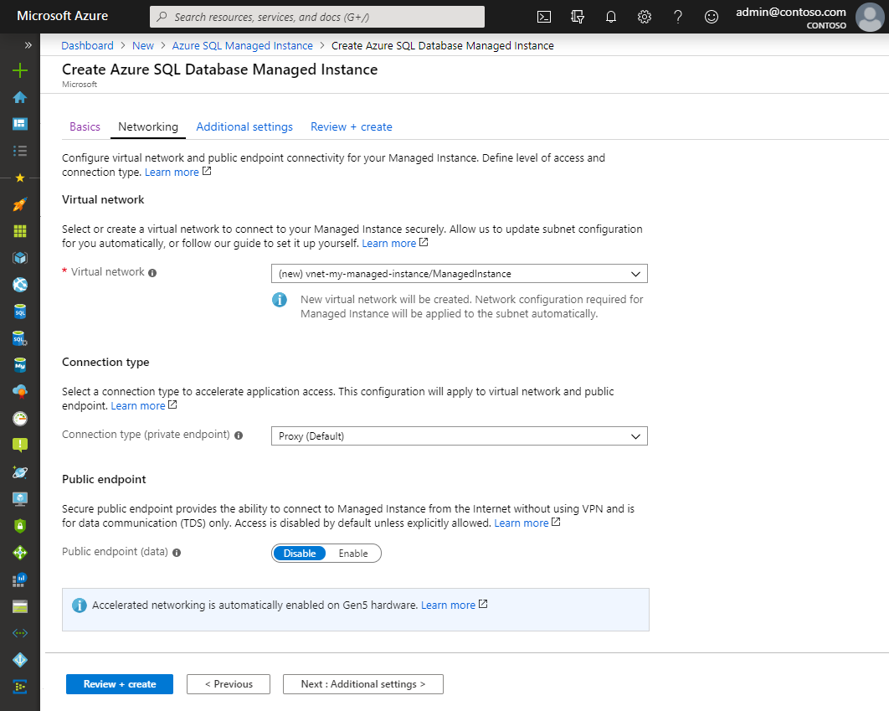
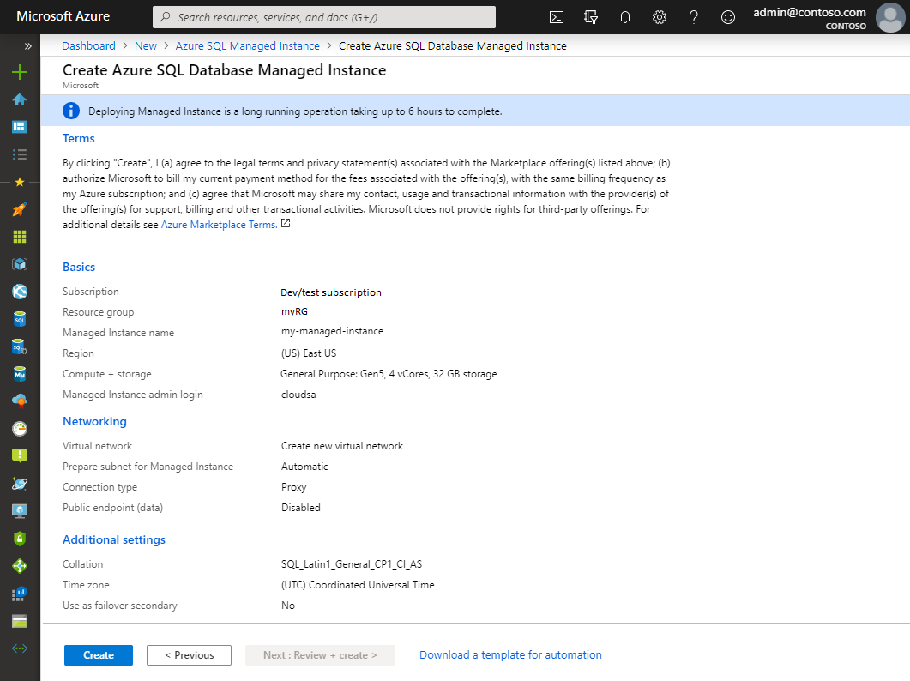

# Mini-lab:Create an Azure SQL Database Managed Instance

This demonstration walks you through how to create an Azure SQL Database managed instance in Azure portal.

Sign in to [Azure portal](https://portal.azure.com/).

## Create a managed instance

The following steps show you how to create a managed instance:

1. Select **Azure SQL** on the left menu of Azure portal. If **Azure SQL** is not in the list, select **All services**, and then enter *Azure SQL* in the search box.

2. Select **+Add** to open the **Select SQL deployment option** page. You can view additional information about an Azure SQL Database managed instance by selecting **Show details** on the **Managed instances** tile.

3. Select **Create**.

4. Use the tabs on the **Create Azure SQL Database Managed Instance** provisioning form to add required and optional information. The following sections describe these tabs.

## Basics

* Fill out mandatory information required on the **Basics** tab.

Use the table below as a reference for information required at this tab.

| Setting | Suggested value | Description  |
|---------------------------------------------------|---------------------------------------------------------------------------------|-------------------------------------------------------------------------------------------------------------------------------------------------------------------------------------------------------------------------------------------------------------------------------------------------------------------------------------------------------------------------------------------------------------------------------------------------------------------------------------------------------------------------------------------------------------------------------------------------------------------------------------------------------------------------------------------------------------|
| Virtual network | Select either Create new virtual network or a valid virtual network and subnet. | If a network or subnet is unavailable, it must be modified to satisfy the network requirements before you select it as a target for the new managed instance. For information about the requirements for configuring the network environment for a managed instance, see Configure a virtual network for a managed instance. |
| Connection type | Choose between a proxy and a redirect connection type. | For more information about connection types, see Azure SQL Database connection policy. |
| Public endpoint | Select Enable. | For a managed instance to be accessible through the public data endpoint, you need to enable this option. |
| Allow access from (if Public endpoint is enabled) | Select one of the options. | The portal experience enables configuring a security group with a public endpoint.    |

* Select **Configure Managed Instance** to size compute and storage resources and to review the pricing tiers. Use the sliders or text boxes to specify the amount of storage and the number of virtual cores. When you're finished, select **Apply** to save your selection.

* To review your choices before you create a managed instance, you can select **Review + create**. Or, configure networking options by selecting **Next: Networking**.

## Networking

* Fill out optional information on the **Networking** tab. If you omit this information, the portal will apply default settings.

Use the table below as a reference for information required at this tab.

| Setting | Suggested value | Description  |
|---------------------------------------------------|---------------------------------------------------------------------------------|------------------------------------------------------------------------------------------------------------------------------------------------------------------------------------------------------------------------------------------------------------------------------------------------------------------------------|
| Virtual network | Select either Create new virtual network or a valid virtual network and subnet. | If a network or subnet is unavailable, it must be modified to satisfy the network requirements before you select it as a target for the new managed instance. For information about the requirements for configuring the network environment for a managed instance, see Configure a virtual network for a managed instance. |
| Connection type | Choose between a proxy and a redirect connection type. | For more information about connection types, see Azure SQL Database connection policy. |
| Public endpoint | Select Enable. | For a managed instance to be accessible through the public data endpoint, you need to enable this option. |
| Allow access from (if Public endpoint is enabled) | Select one of the options. | The portal experience enables configuring a security group with a public endpoint.    |

* Select **Review + create** to review your choices before you create a managed instance. Or, configure more custom settings by selecting **Next: Additional settings**.

## Additional settings

* Fill out optional information on the **Additional settings** tab. If you omit this information, the portal will apply default settings.

Use the table below as a reference for information required at this tab.

| Setting | Suggested value | Description  |
|-----------------------------------------------------------------------|------------------------------------------------------------------------------------------------------------------------------------------------------------------------------------------------------------|-----------------------------------------------------------------------------------------------------------------------------------------------------------------------|
| Collation | Choose the collation that you want to use for your managed instance. If you migrate databases from SQL Server, check the source collation by using SELECT SERVERPROPERTY(N'Collation') and use that value. | For information about collations, see Set or change the server collation. |
| Time zone | Select the time zone that your managed instance will observe. | For more information, see Time zones. |
| Use as failover secondary | Select Yes. | Enable this option to use the managed instance as a failover group secondary. |
| Primary managed instance (if Use as failover secondary is set to Yes) | Choose an existing primary managed instance that will be joined in the same DNS zone with the managed instance you're creating. | This step will enable post-creation configuration of the failover group.  |

## Review + create

5. Select **Review + create** tab to review your choices before you create the managed instance.

6. Select **Create** to start provisioning the managed instance.

 
