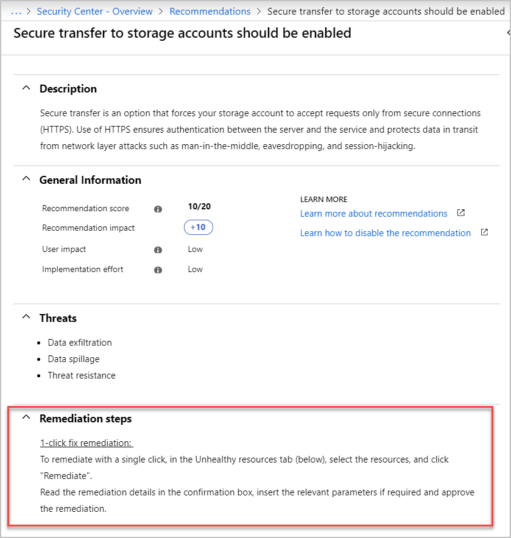
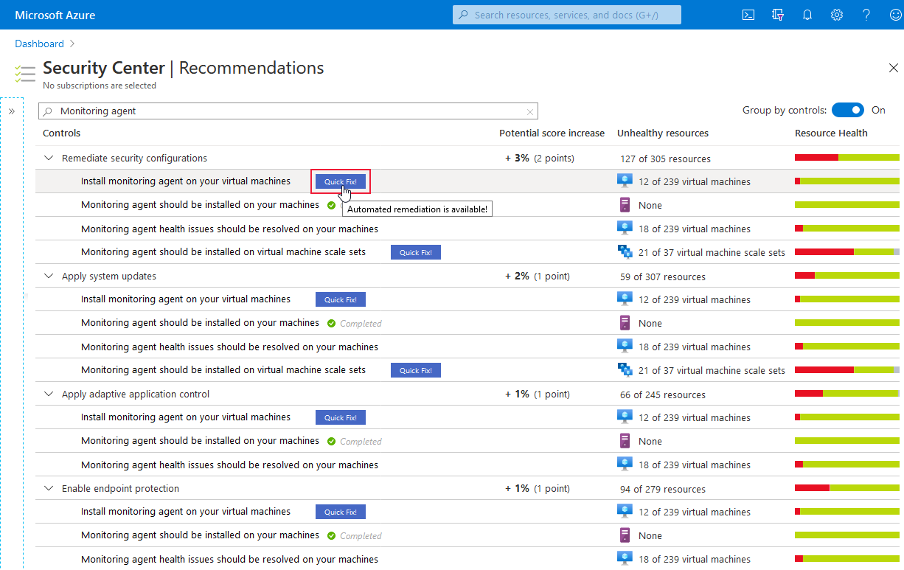

# Mini-lab: Azure Security Center

For this demonstration, you will require one or more Linux VMs **without** monitoring agent activated.

## Navigate to Azure Security Center

1. Sign in to the [Azure portal](https://portal.azure.com).

1. Navigate to **Security Center** > **Recommendations**.

## Add monitoring software via recommendation

Recommendations give you suggestions on how to better secure your resources. You implement a recommendation by following the remediation steps provided in the recommendation.

1. Click a recommenation to open the Remediation steps section, and review the steps. Each recommendation has its own set of instructions. The following screenshot shows remediation steps for configuring applications to only allow traffic over HTTPS.

    

1. Return to the recommendations list. Note that some recommendations have a **Quick Fix!** label. Quick Fix enables you to quickly remediate a recommendation on multiple resources. It's only available for specific recommendations. Quick Fix simplifies remediation and enables you to quickly increase your Secure Score, improving your environment's security.

1. From the **Remediate security configurations** list, next to the **Install monitoring agent on your virtual machines** recommendation, click **Quick Fix!**

    

1. From the **Unhealthy resources** tab, select the resources that you want to implement the recommendation on, and click **Remediate**.

    >:heavy_check_mark: **Note:** Some of the listed resources might be disabled, because you don't have the appropriate permissions to modify them.

1. In the confirmation box, read the remediation details and implications.

    >:heavy_check_mark: **Note:** The implications are listed in the grey box in the **Remediate resources** window that opens after clicking **Remediate**. They list what changes happen when proceeding with the Quick Fix remediation.

1. Insert the relevant parameters if necessary, and approve the remediation.

    >:heavy_check_mark: **Note:** It can take several minutes after remediation completes to see the resources in the **Healthy resources** tab. To view the remediation actions, check the activity log.

1. Once completed, a notification appears informing you if the remediation succeeded.