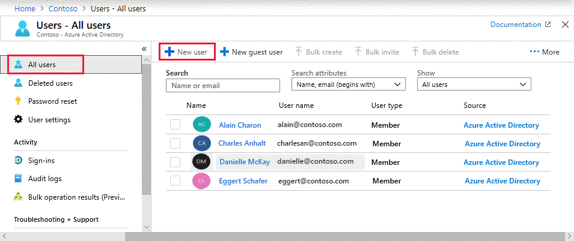

# Mini-lab: Add users by using Azure Active Directory

Add new users or delete existing users from your Azure Active Directory (Azure AD) organization. To add or delete users you must be a User administrator or Global administrator.

You can create a new user using the Azure Active Directory portal. Follow these steps:

1.	Sign in to the [Azure portal](https://portal.azure.com) as a User administrator for the organization.

2.	Search for and select *Azure Active Directory* from any page.

3.	Select **Users**, and then select **New user**.

    

4.	On the **User** page, enter information for this user:

    - **Name**. Required. The first and last name of the new user. For example, *TesterAAD*.

    - **User name**. Required. The user name of the new user. For example, *TesterAAD@contoso.com*. The domain part of the user name must use either the initial default domain name, *<yourdomainname>.onmicrosoft.com*, or a custom domain name, such as *contoso.com*.

    - **Job info**: You can add more information about the user here, or do it later. For more information about adding user info, see [How to add or change user profile information](https://docs.microsoft.com/en-us/azure/active-directory/fundamentals/active-directory-users-profile-azure-portal).

5.	Copy the autogenerated password provided in the **Password** box. You'll need to give this password to the user to sign in for the first time.

6.	Select **Create**.

The user is created and added to your Azure AD organization.