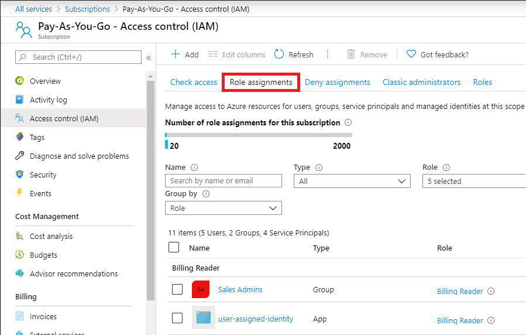
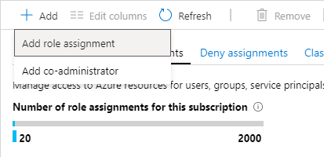

# Mini-lab: Add an Azure Role Assignment 

## Prerequisites

To add or remove role assignments, you must have:

* ```Microsoft.Authorization/roleAssignments/write``` and ```Microsoft.Authorization/roleAssignments/delete``` permissions, such as U*ser Access Administrator* or *Owner*.


**Access control (IAM)** is the blade that you use to assign roles to grant access to Azure resources. It's also known as identity and access management and appears in several locations in the Azure portal. The following shows an example of the Access control (IAM) blade for a subscription.


To be the most effective with the Access control (IAM) blade, it helps if you can answer the following three questions when you are trying to assign a role:

**1. Who needs access?**

Who refers to a user, group, service principal, or managed identity. This is also called a *security principal*.

**2. What role do they need?**

Permissions are grouped together into roles. You can select from a list of several [built-in roles or you can use your own custom roles.

**3. Where do they need access?**

Where refers to the set of resources that the access applies to. Where it can be a management group, subscription, resource group, or a single resource such as a storage account. This is called the *scope*.

## Add a role assignment

In Azure RBAC, to grant access to an Azure resource, you add a role assignment. Follow these steps to assign a role.

1. In the Azure portal, click **All services** and then select the scope that you want to grant access to. 

2. Click the specific resource for that scope.

3. Click **Access control (IAM)**.

4. Click the **Role assignments** tab to view the role assignments at this scope.



5. Click **Add** > **Add role assignment**.

If you don't have permissions to assign roles, the **Add role assignment** option will be disabled.



The **Add role assignment** pane opens.


6. In the **Role** drop-down list, select a role such as **Virtual Machine Contributor**.

7. In the **Select** list, select a user, group, service principal, or managed identity. If  the security principal is not found in the list, you can type in the **Select** box to search the directory for display names, email addresses, and object identifiers.

8. Click **Save** to assign the role.

After a few moments, the security principal is assigned the role at the selected scope.


 
