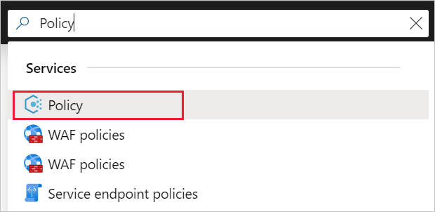
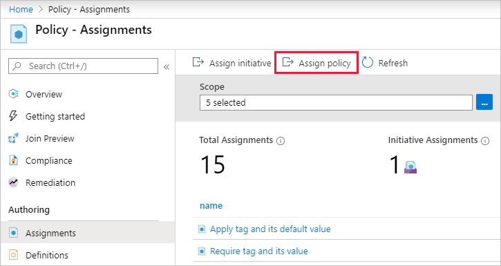
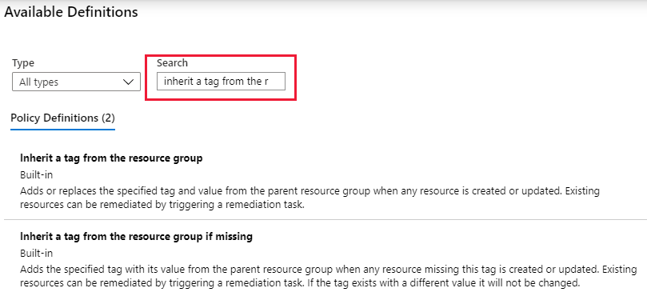

# Mini-lab: Create and Manage A Policy to Enforce Compliance

In this demonstration, you learn to use Azure Policy to do some of the more common tasks related to creating, assigning, and managing policies across your organization, such as:

* Assign a policy to enforce a condition for resources you create in the future

* Create and assign an initiative definition to track compliance for multiple resources

* Resolve a non-compliant or denied resource

* Implement a new policy across an organization

## Assign a policy

The first step in enforcing compliance with Azure Policy is to assign a policy definition. A policy definition defines under what condition a policy is enforced and what effect to take. In this example, assign the built-in policy definition called *Inherit a tag from the resource group if missing* to add the specified tag with its value from the parent resource group to new or updated resources missing the tag.

1. Go to the Azure portal to assign policies. Search for and select **Policy**.

2. Select **Assignments** on the left side of the Azure Policy page. An assignment is a policy that has been assigned to take place within a specific scope.

3. Select **Assign Policy** from the top of the **Policy - Assignments** page.

4. On the **Assign Policy** page and **Basics** tab, select the **Scope** by selecting the ellipsis and selecting either a management group or subscription. Optionally, select a resource group. A scope determines what resources or grouping of resources the policy assignment gets enforced on. Then select **Select** at the bottom of the **Scope** page.

5. Resources can be excluded based on the Scope. Exclusions start at one level lower than the level of the **Scope. Exclusions** are optional, so leave it blank for now.

6. Select the **Policy definition** ellipsis to open the list of available definitions. You can filter the policy definition **Type** to *Built-in* to view all and read their descriptions.

7. Select **Inherit a tag from the resource group if missing**. Select **Select** at the bottom of the **Available Definitions** page once you have found and selected the policy definition.

8. The **Assignment name** is automatically populated with the policy name you selected, but you can change it. For this example, leave *Inherit a tag from the resource group if missing*. You can also add an optional **Description**. The description provides details about this policy assignment.

9. Leave **Policy enforcement** as *Enabled*. When *Disabled*, this setting allows testing the outcome of the policy without triggering the effect. 

10. **Assigned by** is automatically filled based on who is logged in. 

11. Select the **Parameters** tab at the top of the wizard.

12. For **Tag Name**, enter *Environment*.

13. Select the **Remediation** tab at the top of the wizard.

14. Leave **Create a remediation task** unchecked. This box allows you to create a task to alter existing resources in addition to new or updated resources. 

15. **Create a Managed Identity** is automatically checked since this policy definition uses the modify effect. **Permissions** is set to *Contributor* automatically based on the policy definition. 

16. Select the **Review + create** tab at the top of the wizard.

17. Review your selections, then select **Create** at the bottom of the page.